# Audia - Transcrição e Chat com IA

Sistema completo de transcrição de áudios/vídeos longos com diarização, resumo inteligente e chat interativo sobre o conteúdo.

## 🎯 Funcionalidades

- ✅ Transcrição de áudios/vídeos longos com **diarização** (identificação de speakers)
- ✅ **Resumo automático** em linguagem natural
- ✅ **Chat interativo** para fazer perguntas sobre o conteúdo transcrito
- ✅ Interface web moderna e responsiva
- ✅ Processamento assíncrono de jobs
- ✅ Hospedagem 100% em **Oracle Cloud Free Tier**
- ✅ Integração com **Azure Speech** e **Azure OpenAI**

## 🏗️ Arquitetura

```mermaid
graph TB
    subgraph "VM1 - Frontend (OCI Free Tier)"
        A[Next.js App<br/>React + TypeScript]
        B[Nginx<br/>Reverse Proxy + SSL]
    end

    subgraph "VM2 - Backend (OCI Free Tier)"
        C[FastAPI<br/>API REST]
        D[Celery Worker<br/>Processamento Async]
        E[Redis<br/>Fila + Cache]
        F[FAISS<br/>Vector Store]
        G[SQLite<br/>Users DB]
    end

    subgraph "Oracle Cloud Infrastructure"
        H[Object Storage<br/>Bucket: audia-media]
    end

    subgraph "Azure Services"
        I[Speech Batch API<br/>Transcrição + Diarização]
        J[OpenAI API<br/>GPT-4 + Embeddings]
    end

    subgraph "Cliente"
        K[Navegador Web]
    end

    K -->|HTTPS| B
    B -->|Proxy| A
    A -->|API Calls| B
    B -->|HTTP| C

    C -->|Enfileira Jobs| E
    E -->|Processa Jobs| D

    C -->|Auth JWT| G
    D -->|Upload/Download| H
    C -->|Upload/Download| H

    D -->|Criar Job Transcrição| I
    I -->|Resultado JSON| D

    D -->|Embeddings + Chat| J
    C -->|Resumo + Chat| J

    D -->|Indexa Chunks| F
    C -->|Busca Semântica| F

    style K fill:#e1f5ff
    style A fill:#61dafb
    style B fill:#269f42
    style C fill:#009688
    style D fill:#ff6b6b
    style E fill:#dc382d
    style F fill:#4a90e2
    style G fill:#003b57
    style H fill:#f80000
    style I fill:#0078d4
    style J fill:#10a37f
```



## 📋 Pré-requisitos

- **Oracle Cloud Account** (Free Tier)
- **Azure Account** com:
  - Azure Speech Service
  - Azure OpenAI Service
- **Docker** & **Docker Compose** (v2.0+)
- **Git**
- **Make** (opcional, mas recomendado)

## 🚀 Setup Azure

### 1. Azure Speech Service

```bash
# Via Azure Portal ou CLI
az cognitiveservices account create \
  --name audia-speech \
  --resource-group audia-rg \
  --kind SpeechServices \
  --sku F0 \
  --location brazilsouth

# Obter chave e região
az cognitiveservices account keys list \
  --name audia-speech \
  --resource-group audia-rg
```

### 2. Azure OpenAI Service

```bash
# Criar recurso OpenAI
az cognitiveservices account create \
  --name audia-openai \
  --resource-group audia-rg \
  --kind OpenAI \
  --sku S0 \
  --location eastus

# Deploy dos modelos
# Via Portal: criar deployments para:
# - gpt-4 (chat e resumo)
# - text-embedding-ada-002 (embeddings)
```

Anote:
- `AZURE_SPEECH_KEY` e `AZURE_SPEECH_REGION`
- `AZURE_OPENAI_ENDPOINT`, `AZURE_OPENAI_KEY`
- Nomes dos deployments

## ☁️ Setup Oracle Cloud Infrastructure

### 1. Criar Compartment

```bash
# Via OCI CLI
oci iam compartment create \
  --name audia-compartment \
  --description "Compartment for Audia project"
```

### 2. Criar Object Storage Bucket

```bash
# Criar bucket público para armazenar mídias
oci os bucket create \
  --name audia-media \
  --compartment-id <COMPARTMENT_OCID>

# Configurar lifecycle policy (deletar após 90 dias)
oci os object-lifecycle-policy put \
  --bucket-name audia-media \
  --items '[{"name":"delete-old","action":"DELETE","timeAmount":90,"timeUnit":"DAYS","isEnabled":true,"objectNameFilter":{"inclusionPrefixes":["uploads/"]}}]'
```

### 3. Criar VMs Free Tier

```bash
# Executar script de setup
cd deploy/scripts
chmod +x setup-oci.sh
./setup-oci.sh
```

O script criará:
- **VM1** (Frontend): AMD E2.1.Micro, Ubuntu 22.04
- **VM2** (Backend): AMD E2.1.Micro, Ubuntu 22.04

### 4. Configurar Firewall (Security Lists)

Permitir portas:
- **VM1**: 80 (HTTP), 443 (HTTPS)
- **VM2**: 8000 (FastAPI - apenas de VM1)

## 💻 Desenvolvimento Local

### 1. Clonar e Configurar

```bash
git clone <seu-repo>
cd audia

# Copiar e editar variáveis de ambiente
cp .env.example .env
nano .env  # Adicionar suas chaves Azure e OCI

# Instalar dependências
make setup
```

### 2. Configurar .env

Edite o arquivo `.env` com suas credenciais:

```bash
# Azure Speech
AZURE_SPEECH_REGION=brazilsouth
AZURE_SPEECH_KEY=sua_chave_aqui

# Azure OpenAI
AZURE_OPENAI_ENDPOINT=https://sua-instancia.openai.azure.com/
AZURE_OPENAI_KEY=sua_chave_aqui
AZURE_OPENAI_DEPLOYMENT=gpt-4
AZURE_OPENAI_EMBEDDING_DEPLOYMENT=text-embedding-ada-002

# OCI Object Storage
OCI_NAMESPACE=seu_namespace
OCI_BUCKET=audia-media
OCI_REGION=sa-saopaulo-1
OCI_COMPARTMENT_OCID=ocid1.compartment.oc1..xxxxx
OCI_CONFIG_PATH=~/.oci/config

# Redis
REDIS_URL=redis://redis:6379/0

# FAISS
FAISS_PATH=/app/data/faiss_store

# JWT
JWT_SECRET_KEY=gere_uma_chave_segura_aqui_min_32_chars
JWT_ALGORITHM=HS256
JWT_ACCESS_TOKEN_EXPIRE_MINUTES=30
JWT_REFRESH_TOKEN_EXPIRE_DAYS=7

# Database
DATABASE_URL=sqlite:///./data/audia.db
```

### 3. Rodar Ambiente Local

```bash
# Subir toda a stack (backend + worker + redis)
make dev

# Ou manualmente:
docker-compose -f deploy/docker-compose.yml up --build
```

Acesse:
- **Frontend**: http://localhost:3000
- **Backend API**: http://localhost:8000
- **Docs API**: http://localhost:8000/docs

### 4. Rodar Testes

```bash
# Todos os testes
make test

# Apenas backend
cd apps/backend && pytest

# Apenas frontend
cd apps/frontend && npm test
```

## 🚢 Deploy em Produção

### 1. Configurar Secrets no GitHub

Adicione os seguintes secrets no repositório:

```
OCI_VM1_SSH_KEY=<private_key_vm1>
OCI_VM1_HOST=<ip_publico_vm1>
OCI_VM2_SSH_KEY=<private_key_vm2>
OCI_VM2_HOST=<ip_publico_vm2>

# Todas as variáveis do .env como secrets também
AZURE_SPEECH_KEY=...
AZURE_OPENAI_KEY=...
# etc.
```

### 2. Deploy Manual

```bash
# Deploy frontend (VM1)
make deploy-vm1

# Deploy backend (VM2)
make deploy-vm2
```

### 3. Deploy Automático (CI/CD)

Ao fazer push para `main`, o GitHub Actions:
1. Roda testes
2. Builda imagens Docker
3. Faz deploy nas VMs via SSH
4. Executa health checks

## 🧪 Teste End-to-End

1. Acesse `http://<VM1_IP>`
2. Crie uma conta em **Registrar**
3. Faça login
4. Vá para **Upload**
5. Arraste um arquivo de áudio/vídeo (ex: 10 minutos)
6. Aguarde processamento (~5-10min dependendo do tamanho)
7. Veja o status mudar: `QUEUED` → `PROCESSING` → `COMPLETED`
8. Clique na transcrição para ver:
   - Texto completo com diarização (speakers coloridos)
   - Player de áudio/vídeo
9. Use o **Chat** para fazer perguntas sobre o conteúdo
10. Clique em **Gerar Resumo** para ver o resumo automático
11. Baixe a transcrição em TXT ou JSON

## 📁 Estrutura do Projeto

```
audia/
├── apps/
│   ├── backend/              # FastAPI + Celery
│   │   ├── app/
│   │   │   ├── core/         # Config, auth, settings
│   │   │   ├── api/routes/   # Endpoints REST
│   │   │   ├── services/     # Integrações Azure + OCI
│   │   │   ├── workers/      # Celery tasks
│   │   │   ├── models/       # Pydantic schemas
│   │   │   └── utils/        # Helpers
│   │   ├── data/             # SQLite + FAISS
│   │   ├── Dockerfile
│   │   └── requirements.txt
│   │
│   └── frontend/             # Next.js + React
│       ├── app/              # App Router pages
│       ├── components/       # Componentes React
│       ├── lib/              # API client, auth
│       ├── Dockerfile
│       └── package.json
│
├── deploy/
│   ├── docker-compose.yml    # Orquestração
│   ├── nginx/                # Reverse proxy
│   └── scripts/              # Deploy scripts
│
├── .github/workflows/        # CI/CD
├── Makefile
└── README.md
```

## 🔒 Segurança

- ✅ Autenticação JWT com refresh tokens
- ✅ Senhas hasheadas com bcrypt
- ✅ HTTPS/SSL via Let's Encrypt
- ✅ Rate limiting no Nginx
- ✅ CORS configurado
- ✅ Validação de uploads (tipo, tamanho)
- ✅ Sanitização de inputs

## 💰 Estimativa de Custos (Free Tier)

| Serviço | Free Tier | Custo Estimado/Mês |
|---------|-----------|-------------------|
| OCI Compute (2x VMs) | ✅ Grátis | $0 |
| OCI Object Storage | 10 GB grátis | $0 |
| Azure Speech | 5h/mês grátis | $0-5* |
| Azure OpenAI | $5 crédito | $0-10* |
| **TOTAL** | | **$0-15/mês** |

*Dependendo do volume de uso. Recomendado implementar rate limiting.

## 🛠️ Comandos Úteis

```bash
make setup        # Instala dependências
make dev          # Ambiente local
make test         # Roda testes
make build        # Build Docker images
make deploy-vm1   # Deploy frontend
make deploy-vm2   # Deploy backend
make logs         # Ver logs
make clean        # Limpar containers
```

## 📚 Documentação da API

Após rodar o backend, acesse:
- Swagger UI: http://localhost:8000/docs
- ReDoc: http://localhost:8000/redoc

## 🐛 Troubleshooting

### Erro ao conectar com Azure Speech

```bash
# Verificar credenciais
curl -v -X POST "https://${AZURE_SPEECH_REGION}.api.cognitive.microsoft.com/speechtotext/v3.0/transcriptions" \
  -H "Ocp-Apim-Subscription-Key: ${AZURE_SPEECH_KEY}"
```

### Erro ao subir FAISS

```bash
# Verificar permissões do volume
docker-compose exec backend ls -la /app/data/faiss_store
```

### Worker não processa jobs

```bash
# Ver logs do Celery
docker-compose logs -f worker

# Verificar conexão com Redis
docker-compose exec worker celery -A celery_app inspect ping
```

## 🤝 Contribuindo

1. Fork o projeto
2. Crie uma branch: `git checkout -b feature/nova-funcionalidade`
3. Commit: `git commit -m 'Add nova funcionalidade'`
4. Push: `git push origin feature/nova-funcionalidade`
5. Abra um Pull Request

## 📄 Licença

MIT License - veja [LICENSE](LICENSE) para detalhes.

## 🙋 Suporte

- 📧 Email: suporte@audia.com
- 🐛 Issues: [GitHub Issues](https://github.com/seu-usuario/audia/issues)
- 📖 Docs: [Documentação Completa](https://docs.audia.com)

---

**Desenvolvido com ❤️ usando FastAPI, Next.js, Azure AI e Oracle Cloud**
